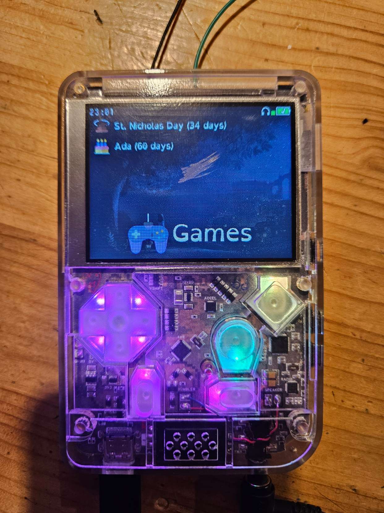

# RCKid mk3

RCKid is an open‑source handheld console designed for young creators. It’s built to be the first piece of technology that feels truly personal to a child — not just a screen to consume, but a tool to imagine, build, and share. RCKid also supports kids in everyday tools like a clock, alarm, piggy bank, contacts, or music player. This balance of fun and function turns RCKid into a trusted companion, introducing kids to digital literacy, technology, and STEM skills in a way that grows with them.

Starting at age 5, kids can design sprites, tiles, and music inside native games, learning problem‑solving naturally through play. As they grow, RCKid supports MakeCode Arcade (blocks → JavaScript/TypeScript), GBStudio for retro game creation, and finally a full C++ SDK for teens and adults ready to explore hardware and systems programming.

A defining feature is RCKid’s cartridge system — not just for games, but for extending hardware. Cartridges can add Wi‑Fi for messaging, radios for mesh networking, JACDAC peripherals, IR remotes, or even exposed pins for DIY tinkering. Each cartridge carries its own firmware, making creations tangible, shareable, and hackable.

Powered by the RP2350 MCU (dual Cortex‑M33, 520KB RAM, PIO), RCKid combines raw performance with developer‑friendly design. It features a 2.8" IPS display at 60 FPS, stereo audio up to 48kHz, SD storage, RGB‑backlit controls, accelerometer, haptics, FM radio, and flexible power (USB‑C Li‑Ion or AAA batteries). Everything is built to be fun, approachable, and resilient.

## Technical Details

- RP2350 MCU from RaspberryPi that mixes raw power (520KB RAM, 2x Cortex M33 cores at 150MHz with overclocking possibility) and ease of use (C++ SDK, micropython). Further supported by great community and skillfully designed so that programming it is *fun* even for experienced developers (PIO)
- unique cartridge system: the firmware is not stored on the device, but in every cartridge. Cartridges can be swapped, shared, or reprogrammed with any computer easily. On top of the mandatory FLASH for the firmware, cartridges contain 8 high speed digital pins (HSTX, SPI, I2C, UART, PWM) and 2 analog pins to enable hardware tinkering
- 2.8" 320x240 IPS display with 65536 colors. Perfect for retro gaming and pixel art with enough catchy detail, but not too many pixels to design. 60 FPS refresh rate.
- 16bit stereo sound (headphones & mono speaker) with up to 48kHz playback. Powerful enough for MP3 playback
- SD card for media & settings, up to 64GB supported. FAT32 and exFAT filesystem 
- DPAD, A, B, Select and Start buttons with customizable RGB backlight
- 3 axis accelerometer with integrated pedometer
- rumbler for haptic feedback (simple motor)
- FM radio with RDS
- 1300mAh LiIon rechargeable battery with USB-C charging, or 3x AAA batteries, both options should give around 10 hours of active time. 

## Directory Structure

- `cartridges` folder contains specific cartridge ROMs that can be build as part of RCKid
- `datasheets` contains copies of datasheets of the hardware used in RCKid
- `hardware` contains hardware related files, such as schematics, PCB layouts and case drawings
- `libs` holds mostly 3rd party libraries that are part of the RCKid SDK
- `sdk` contains the `librckid` SDK library files and all backends
- `lego-remote` AVR firmware for a remote client to control lego bricks, at the moment just parked here from mkI

## Building

Although there is technically nothing that should prevent building the software on Windows, only Linux is officially supported (actually Ubuntu 24.04 running on WSL:). The `setup-ubuntu.sh` must first be executed which installs all the required packages and sets up subprojects, etc.

RCKid uses `cmake` so the following builds the fantasy console & all cartridges on linux:

    mkdir build
    cd build
    cmake ..
    cmake --build .

To build RCKid for the device (mk III in this example), do the following:

    mkdir build-mk3
    cd build-mk3
    cmake .. -DRCKID_BACKEND=MK3
    cmake --build .

### Build Arguments

RCKid's build can be customized using various arguments, such as the `-DARCH` showed above to build for a particular architecture. This section lists other useful build arguments:

- `-DRCKID_WAIT_FOR_SERIAL` runs RCKid to the end of the initialize() function and then waits for a single byte to be sent on the USB-Serial. This is useful to ensure that a serial monitor on the pc is up & running before RCKid's firmware starts doing stuff so that it can be captured properly.

## SDK

The SDK library is at the core of RCKid as it provides an abstraction layer over the console's hardware. Furthermore, it makes RCKid also a fantasy console by being able to run on a PC for most of the features. Therefore the SDK comes in two folder, `rckid` where the common interface resides, and `backends` where specific implementation for the various hardware versions and fantasy consoles is implemented. 

> For now, fantasy console via raylib (Windows and Linux) and  RCKid mk3 (RP2350) are supported. There are plans for future platforms & variations. Note that the fantasy platform is mostly for debugging only.

## Debugging on the Device

    sudo apt-get install pkg-config libjim-dev libudev-dev
    git clone https://github.com/raspberrypi/openocd.git
    
    cd openocd
    ./bootstrap
    ./configure --disable-werror --enable-sysfsgpio --enable-bcm2835gpio
    make -j4
    sudo make install

Connect the SWD port for the RCKid (on devel-server the wires are, from top to bottom, looking from the back, from top to bottom):

         | GND   |
    -----|-------|---------
    blue | green | yellow
    

Then run openocd on the rpi with the following command:

    openocd -f interface/raspberrypi-swd.cfg -f target/rp2350.cfg -c "adapter speed 5000" -c "bindto 0.0.0.0"

And to run the debugger, can run gdb from the computer that compiled the cartridges:

    gdb app.elf
    target remote IP_ADDR:3333

Where `IP_ADDR` is the IP address of the rpi server. 

    monitor reset init
    

(from https://betanet.net/view-post/using-openocd-on-raspberry-pi-4-a)

### AVR Serial TX

AVR does not support on-chip debugging, but to provide at least some debugging hints, the TX pin is available on the debugging header together with AVR UPDI and RP SWD pins. To connect to it connect the TX pin (green cable in devel-server case) and then launch picocom at 115200 baud:

    picocom -b 115200 /dev/ttyAMA0

Where `/dev/ttyAMA0` is your USB device, this one is the default with devel-server. 

> To exit picocom, use C-A C-X. 

### Debug Cartridge

For easier debugging, the debug cartridge has protruding wires to some of the GPIO pins available, namely:

Wire Color | Function
-----------|-----------
Black      | GND
Red        | 3V3
Green      | GPIO 12, UART0 TX
White      | GPIO 13, UART0 RX
Blue       | GPIO 14
Yellow     | GPIO 15

## Attribution

- doxygen theme: https://github.com/jothepro/doxygen-awesome-css
- icons are from flaticon, for detailed attribution, please see ATTRIBUTION.md file 
